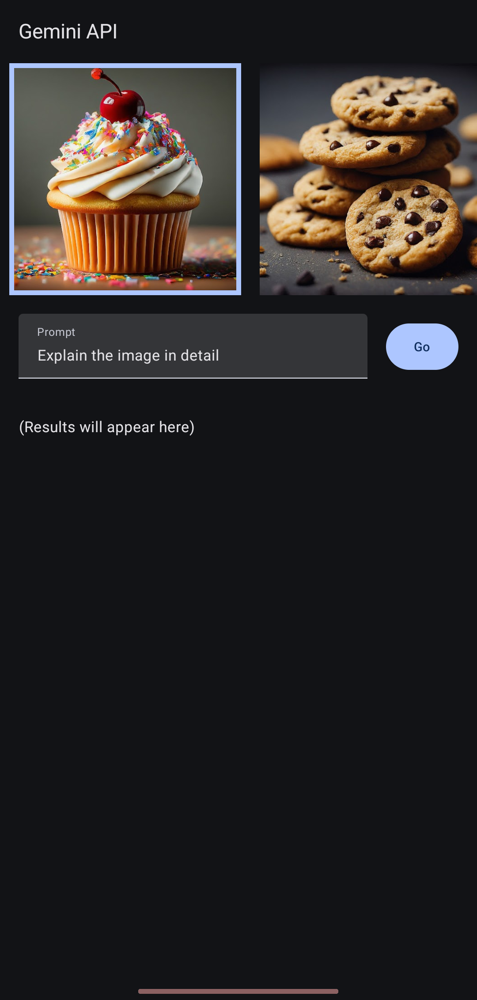
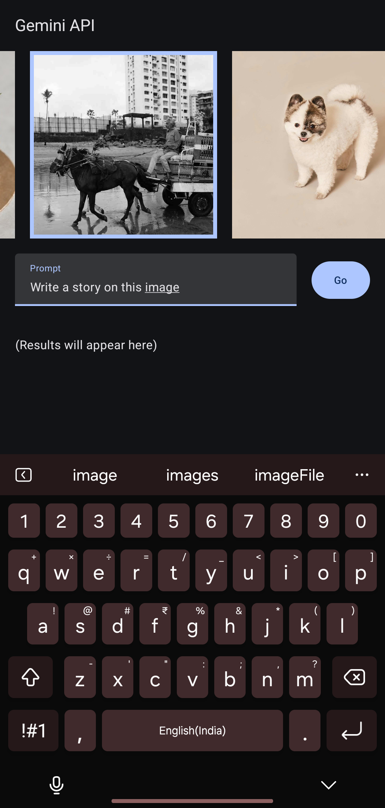

# Implementing Gemini API in an Android App

This repository serves as a refined version of the Android Studio Gemini Starter template. The default template often introduces issues such as outdated dependency versions or incompatible models. To address these, I have made all the necessary adjustments to ensure smooth functionality.

## Features
- **Seamless Gemini API Integration**: Updated dependencies for compatibility.
- **Clean Project Setup**: Resolved configuration issues for a streamlined development experience.
- **Fully Functional Example**: A working implementation of Gemini API, ready to use.

## How to Use

Follow these steps to get started:

1. **Clone the Repository**  
   Clone this repository to your local machine using the following command:
   
   ```bash
   git clone https://github.com/prathamngundikere/Implementing_GeminiAPI_in_Android_App.git
   ```
2. **Set Up API Key**
   * Navigate to the `local.properties` file in the project root.
   * Add your API key as shown below:
     
     ```properties
     apikey="your_api_key_here"
     ```
3.  **Sync the Project**

    Open the project in Android Studio and sync the Gradle files.

5. **Run the Application** 

    Build and run the project on your desired Android device or emulator
   
## Screenshots

<div style="display: flex; justify-content: space-between;">
    
    
    
</div>

## Why Use This Repository?
This repository eliminates the headaches often encountered with the default Gemini Starter template by ensuring: 
* Updated dependency versions.
* Compatible model usage.
* Clear instructions for setup and deployment.

Feel free to fork this project, open issues, or submit pull requests for further improvements!


